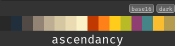

<h1> Ascendancy Colour Scheme</h1>

> The Ascendancy colour scheme aims to provide a comforting spectrum of background and foreground shades, complimented by soft but regal colours.
> 
> The palette has a small bias towards golden colours without creating a sense of washed out overexposure.

## Palette
| colour                                                | base0X | hex       | terminal equivalent | base 16 styling guidelines |
| --------------------------------------------------   | ------ | -------   | -------------       | ---------------                                                                           |
|  | base00 | `#282828` | ----                | Default Background                                                                        |
|  | base01 | `#212f3d` | ---                 | Lighter Background (Used for status bars, line number and folding marks)                  |
|  | base02 | `#504945` | --                  | Selection Background                                                                      |
|  | base03 | `#928374` | -                   | Comments, Invisibles, Line Highlighting                                                   |
|  | base04 | `#bdae93` | +                   | Dark Foreground (Used for status bars)                                                    |
|  | base05 | `#d5c7a1` | ++                  | Foreground, Caret, Delimiters, Operators                                                  |
|  | base06 | `#ebdbb2` | +++                 | Light Foreground (Not often used)                                                         |
|  | base07 | `#fbf1c7` | ++++                | Lightest Foreground (Not often used)                                                      |
|  | base08 | `#c03900` | red                 | Vars, XML Tags, Markup Link Text, Markup Lists, Diff Deleted                              |
|  | base09 | `#fe8019` | orange              | Integers, Boolean, Constants, XML Attributes, Markup Link Url                             |
|  | base0A | `#ffcc1b` | yellow              | Classes, Markup Bold, Search Text Background                                              |
|  | base0B | `#b8bb26` | green               | Strings, Inherited Class, Markup Code, Diff Inserted                                      |
|  | base0C | `#8f3f71` | cyan                | Support, Regular Expressions, Escape Characters, Markup Quotes                            |
|  | base0D | `#458588` | blue                | Functions, Methods, Attribute IDs, Headings                                               |
|  | base0E | `#fabd2f` | magenta             | Keywords, Storage, Selector, Markup Italic, Diff Changed                                  |
|  | base0F | `#b59b4d` | darkred             | Deprecated, Opening/Closing Embedded Language Tags, e.g. `<?php ?>`                       |

This scheme is also hosted on the [tinted-theming/schemes](github.com/tinted-theming/schemes) repository; it can easily be applied to your environment by using any utility that references `tinted-theming` for colour schemes.

For example, on NixOS, the scheme can be conveniently applied to your environment using utilities such as [stylix](https://github.com/nix-community/stylix) or [base16.nix](https://github.com/SenchoPens/base16.nix).

## Acknowledgements

Inspired by the [Gruvbox](https://github.com/morhetz/gruvbox) Dark, Medium scheme as a starting point.
